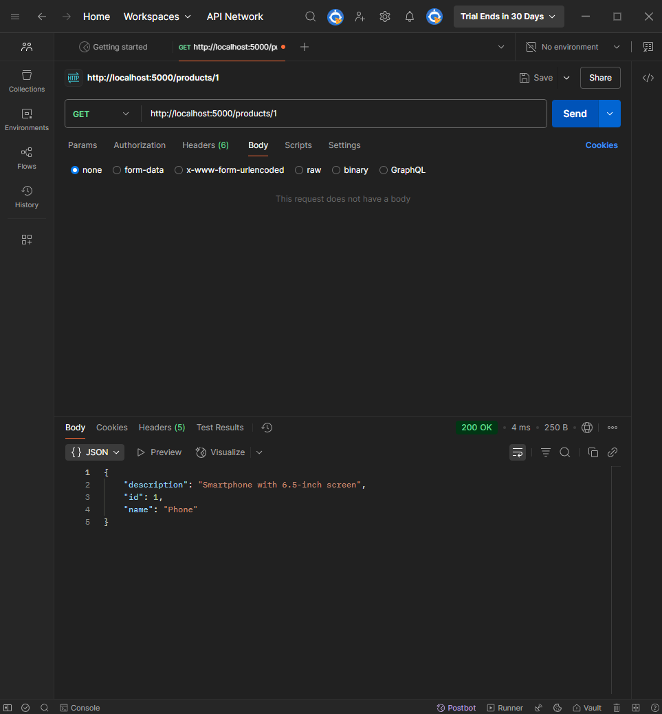

# Практика 2. Rest Service

## Программирование. Rest Service. Часть I

### Задание А (3 балла)
Создайте простой REST сервис, в котором используются HTTP операции GET, POST, PUT и DELETE.
Предположим, что это сервис для будущего интернет-магазина, который пока что умеет 
работать только со списком продуктов. У каждого продукта есть поля: `id` (уникальный идентификатор),
`name` и `description`. 

Таким образом, json-схема продукта (обозначим её `<product-json>`):

```json
{
  "id": 0,
  "name": "string",
  "description": "string"
}
```

Данные продукта от клиента к серверу должны слаться в теле запроса в виде json-а, **не** в параметрах запроса.

Ваш сервис должен поддерживать следующие операции:
1. Добавить новый продукт. При этом его `id` должен сгенерироваться автоматически
   - `POST /product`
   - Схема запроса:
     ```json
     {
       "name": "string",
       "description": "string"
     }
     ```
   - Схема ответа: `<product-json>` (созданный продукт)
   
2. Получить продукт по его id
   - `GET /product/{product_id}`
   - Схема ответа: `<product-json>`
   
3. Обновить существующий продукт (обновляются только те поля продукта, которые были переданы в теле запроса)
   - `PUT /product/{product_id}`
   - Схема запроса: `<product-json>` (некоторые поля могут быть опущены)
   - Схема ответа: `<product-json>` (обновлённый продукт)
   
4. Удалить продукт по его id
   - `DELETE /product/{product_id}`
   - Схема ответа: `<product-json>` (удалённый продукт)
   
5. Получить список всех продуктов 
   - `GET /products`  
   - Схема ответа:
     ```
     [ 
       <product-json-1>,
       <product-json-2>, 
       ... 
     ]
     ```
   

Предусмотрите возвращение ошибок (например, если запрашиваемого продукта не существует).

Вы можете положить код сервиса в отдельную директорию рядом с этим документом.

### Задание Б (3 балла)
Продемонстрируйте работоспособность сервиса с помощью программы Postman
(https://www.postman.com/downloads) и приложите соответствующие скрины, на которых указаны
запросы и ответы со стороны сервиса для **всех** его операций.

#### Демонстрация работы





### Задание В (4 балла)
Пусть ваш продукт также имеет иконку (небольшую картинку). Формат иконки (картинки) может
быть любым на ваш выбор. Для простоты будем считать, что у каждого продукта картинка одна.

Добавьте две новые операции:
1. Загрузить иконку:
   - `POST product/{product_id}/image`
   - Запрос содержит бинарный файл — изображение  
     
2. Получить иконку:
   - `GET product/{product_id}/image`
   - В ответе передаётся только сама иконка  
     

Измените операции в Задании А так, чтобы теперь схема продукта содержала сведения о загруженной иконке, например, имя файла или путь:
```json
"icon": "string"
```

#### Демонстрация работы


_(*) В последующих домашних заданиях вам будет предложено расширить функционал данного сервиса._

## Задачи

### Задача 1 (2 балла)
Общая (сквозная) задержка прохождения для одного пакета от источника к приемнику по пути,
состоящему из $N$ соединений, имеющих каждый скорость $R$ (то есть между источником и
приемником $N - 1$ маршрутизатор), равна $d_{\text{сквозная}} = N \dfrac{L}{R}$
Обобщите данную формулу для случая пересылки количества пакетов, равного $P$.

#### Решение
При store‐and‐forward со «сквозным конвейером» первый пакет идёт $N\frac{L}{R}$, а каждый следующий «догоняет» с интервалом $\frac{L}{R}$.  
- Общее время до прихода \(P\)-го пакета:  
    $d_{\text{для }P\text{ пакетов}}$ 
    = $\bigl(N + P - 1\bigr)\,\frac{L}{R}$.
- (Если бы пересылали строго подряд без конвейера, тогда $d = P\,N\,\frac{L}{R}$, но обычно подразумевается конвейер.)


### Задача 2 (2 балла)
Допустим, мы хотим коммутацией пакетов отправить файл с хоста A на хост Б. Между хостами установлены три
последовательных канала соединения со следующими скоростями передачи данных:
$R_1 = 200$ Кбит/с, $R_2 = 3$ Мбит/с и $R_3 = 2$ Мбит/с.
Сколько времени приблизительно займет передача на хост Б файла размером $5$ мегабайт?
Как это время зависит от размера пакета?

#### Решение
1. Пусть длина пакета $L$ (бит), число пакетов $P = \lceil (40\times10^6)/L\rceil$.  
2. Время передачи одного пакета по трём каналам (store‐and‐forward):  
   $
     \tau_1 = \frac{L}{R_1},\quad \tau_2 = \frac{L}{R_2},\quad \tau_3 = \frac{L}{R_3}, 
     \qquad 
     d^{(1)} = \tau_1 + \tau_2 + \tau_3.
   $
3. Самое медленное звено — $R_1 = 0{,}2\,\text{Мбит/с}$. Тогда $\max(\tau_i)=\tau_1=L/(0{,}2\times10^6)=5\,L/10^6$.  
   Общее время до \(P\)-го пакета:  
   $
     t_{\text{file}} = d^{(1)} + (P-1)\,\tau_1 
     = \Bigl(\tau_1 + \tau_2 + \tau_3\Bigr) + (P-1)\,\tau_1.
   $
4. Подставим численно:  
   $
     \tau_1 = \frac{L}{0{,}2\times10^6},\quad 
     \tau_2 = \frac{L}{3\times10^6},\quad 
     \tau_3 = \frac{L}{2\times10^6}.
   $  
   $
     \tau_1 + \tau_2 + \tau_3 
     = 5\,\frac{L}{10^6} + 0{,}3333\,\frac{L}{10^6} + 0{,}5\,\frac{L}{10^6} 
     = 5{,}8333\,\frac{L}{10^6}\;\text{с}.
   $ 
   $
     P \approx \frac{40\times10^6}{L}.
   $  
   $
     t_{\text{file}} 
     \approx 5{,}8333\,\frac{L}{10^6} + \Bigl(\frac{40\times10^6}{L} - 1\Bigr)\,5\,\frac{L}{10^6}.
   $
   Упростив:  
   $
     t_{\text{file}}(L) \approx 200\;\text{с} \;+\; 0{,}8333\,\frac{L}{10^6}\;\text{с}.
   $
   Поэтому **приблизительно** передача $5\,\text{МБ}$ займёт около $200$ с (≈ 3 мин), а зависимость от $L$ — добавка $0{,}8333\,L/10^6$.  


### Задача 3 (2 балла)
Предположим, что пользователи делят канал с пропускной способностью $2$ Мбит/с. Каждому
пользователю для передачи данных необходима скорость $100$ Кбит/с, но передает он данные
только в течение $20$ процентов времени использования канала. Предположим, что в сети всего $60$
пользователей. А также предполагается, что используется сеть с коммутацией пакетов. Найдите
вероятность одновременной передачи данных $12$ или более пользователями.

#### Решение
todo

### Задача 4 (2 балла)
Пусть файл размером $X$ бит отправляется с хоста А на хост Б, между которыми три линии связи и
два коммутатора. Хост А разбивает файл на сегменты по $S$ бит каждый и добавляет к ним
заголовки размером $80$ бит, формируя тем самым пакеты длиной $L = 80 + S$ бит. Скорость
передачи данных по каждой линии составляет $R$ бит/с. Загрузка линий мала, и очередей пакетов
нет. При каком значении $S$ задержка передачи файла между хостами А и Б будет минимальной?
Задержкой распространения сигнала пренебречь.

#### Решение
1. Количество пакетов $P = \frac{X}{S}$.  
2. «Сквозная» задержка первого пакета: $3\frac{L}{R}$. Каждый следующий «догоняет» с интервалом $\frac{L}{R}$.  
   Значит, $P$-й пакет придёт через  
   $
     t = \Bigl(3+\,(P-1)\Bigr)\,\frac{L}{R} = \Bigl(\tfrac{X}{S} + 2\Bigr)\,\frac{80+S}{R}.
   $
3. Минимизируем  
   $
     t(S) = \Bigl(\tfrac{X}{S} + 2\Bigr)\,\frac{S + 80}{R}.
   $
   Раскрываем:  
   $
     t(S) = \frac{1}{R}\bigl[X + 80\,\frac{X}{S} + 2S + 160\bigr] 
          = \frac{X+160}{R} + \frac{80\,X}{R\,S} + \frac{2S}{R}.
   $
   Минимум по \(S\) даёт условие  
   $
     \frac{d}{dS}\Bigl(\frac{80\,X}{R\,S} + \frac{2S}{R}\Bigr) = 0 
     \;\Longrightarrow\; -\,\frac{80\,X}{R\,S^2} + \frac{2}{R} = 0 
     \;\Longleftrightarrow\; S^2 = 40\,X.
   $
4. Итого  
   $
     S_{\text{opt}} = \sqrt{40\,X}
   $

### Задание 5 (2 балла)
Рассмотрим задержку ожидания в буфере маршрутизатора. Обозначим через $I$ интенсивность
трафика, то есть $I = \dfrac{L a}{R}$.
Предположим, что для $I < 1$ задержка ожидания вычисляется как $\dfrac{I \cdot L}{R (1 – I)}$. 
1. Напишите формулу для общей задержки, то есть суммы задержек ожидания и передачи.
2. Опишите зависимость величины общей задержки от значения $\dfrac{L}{R}$.

#### Решение
todo
