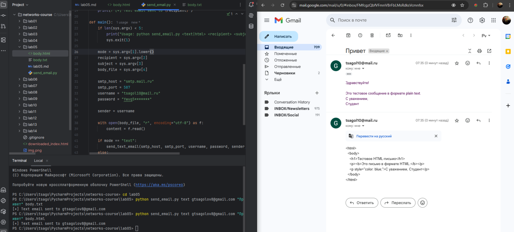
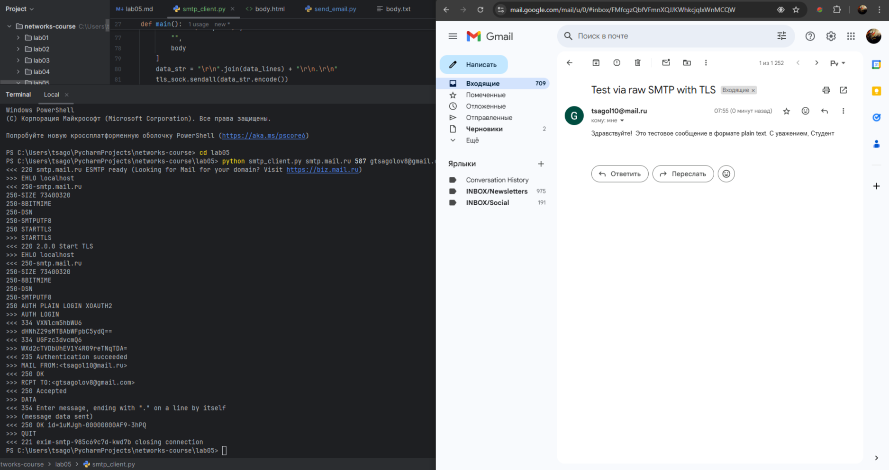
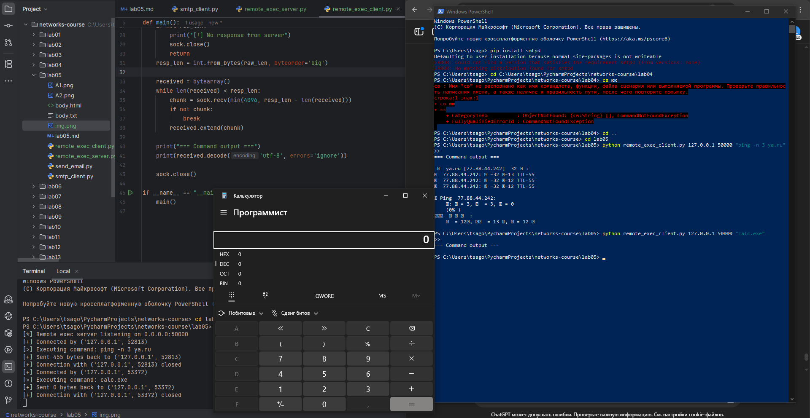
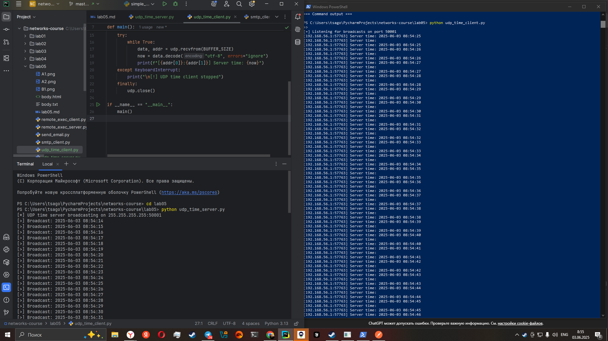
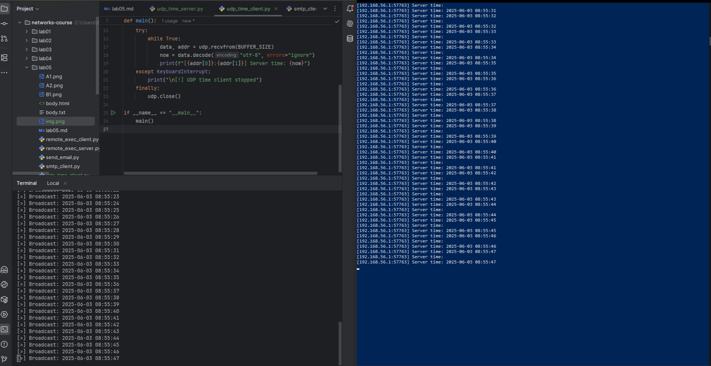

# Практика 5. Прикладной уровень

## Программирование сокетов.

### A. Почта и SMTP (7 баллов)

### 1. Почтовый клиент (2 балла)
Напишите программу для отправки электронной почты получателю, адрес
которого задается параметром. Адрес отправителя может быть постоянным. Программа
должна поддерживать два формата сообщений: **txt** и **html**. Используйте готовые
библиотеки для работы с почтой, т.е. в этом задании **не** предполагается общение с smtp
сервером через сокеты напрямую.

Приложите скриншоты полученных сообщений (для обоих форматов).

#### Демонстрация работы
- 

### 2. SMTP-клиент (3 балла)
Разработайте простой почтовый клиент, который отправляет текстовые сообщения
электронной почты произвольному получателю. Программа должна соединиться с
почтовым сервером, используя протокол SMTP, и передать ему сообщение.
Не используйте встроенные методы для отправки почты, которые есть в большинстве
современных платформ. Вместо этого реализуйте свое решение на сокетах с передачей
сообщений почтовому серверу.

#### Демонстрация работы
- 

### 3. SMTP-клиент: бинарные данные (2 балла)
Модифицируйте ваш SMTP-клиент из предыдущего задания так, чтобы теперь он мог
отправлять письма с изображениями (бинарными данными).

Сделайте скриншот, подтверждающий получение почтового сообщения с картинкой.

#### Демонстрация работы
todo

---

_Многие почтовые серверы используют ssl, что может вызвать трудности при работе с ними из
ваших приложений. Можете использовать для тестов smtp сервер СПбГУ: mail.spbu.ru, 25_

### Б. Удаленный запуск команд (3 балла)
Напишите программу для запуска команд (или приложений) на удаленном хосте с помощью TCP сокетов.

Например, вы можете с клиента дать команду серверу запустить приложение Калькулятор или
Paint (на стороне сервера). Или запустить консольное приложение/утилиту с указанными
параметрами. Однако запущенное приложение **должно** выводить какую-либо информацию на
консоль или передавать свой статус после запуска, который должен быть отправлен обратно
клиенту. Продемонстрируйте работу вашей программы, приложив скриншот.

Например, удаленно запускается команда `ping yandex.ru`. Результат этой команды (запущенной на
сервере) отправляется обратно клиенту.

#### Демонстрация работы
- 

### В. Широковещательная рассылка через UDP (2 балла)
Реализуйте сервер (веб-службу) и клиента с использованием интерфейса Socket API, которая:
- работает по протоколу UDP
- каждую секунду рассылает широковещательно всем клиентам свое текущее время
- клиент службы выводит на консоль сообщаемое ему время

#### Демонстрация работы
- 
- 
## Задачи

### Задача 1 (2 балла)
Рассмотрим короткую, $10$-метровую линию связи, по которой отправитель может передавать
данные со скоростью $150$ бит/с в обоих направлениях. Предположим, что пакеты, содержащие
данные, имеют размер $100000$ бит, а пакеты, содержащие только управляющую информацию
(например, флаг подтверждения или информацию рукопожатия) – $200$ бит. Предположим, что у
нас $10$ параллельных соединений, и каждому предоставлено $1/10$ полосы пропускания канала
связи. Также допустим, что используется протокол HTTP, и предположим, что каждый
загруженный объект имеет размер $100$ Кбит, и что исходный объект содержит $10$ ссылок на другие
объекты того же отправителя. Будем считать, что скорость распространения сигнала равна
скорости света ($300 \cdot 10^6$ м/с).
1. Вычислите общее время, необходимое для получения всех объектов при параллельных
непостоянных HTTP-соединениях
2. Вычислите общее время для постоянных HTTP-соединений. Ожидается ли существенное
преимущество по сравнению со случаем непостоянного соединения?

#### Решение
#### 1. Параллельные **непостоянные** HTTP-соединения  

Для каждого из 11 непостоянных соединений  
(1 — базовый HTML + 10 — встроенные объекты):

| Направление | Содержимое | Биты |
|-------------|-----------|------|
| uplink | SYN + ACKSYN + HTTP-запрос + ACKданные | 4 × 200 = 800 |
| downlink | SYN-ACK + объект | 200 + 100 000 = 100 200 |

Всего по линии ↓: 11 · 100 200 = **1 102 200 бит**  
Всего по линии ↑: 11 ·  800 = 8 800 бит

Главное время задаёт нисходящий поток (150 бит/с ⇒ полоса 150/10 = 15 бит/с на каждое из 10 соединений, но суммарно всё-равно 150 бит/с).

$
T_{\text{non-p}} = \frac{1\,102\,200}{150}\; \approx\;7 348\text{ с} 
$

#### 2. **Постоянное** HTTP-соединение (одна труба)

* Рукопожатие выполняется один раз ⇒ 3 × 200 бит
* HTTP-запросы: 11 × 200 бит
* HTTP-ответы: 11 × 100 000 бит

| Поток | Биты |
|-------|------|
| uplink | 200 (SYN) + 200 (ACK) + 11 · 200 = 2 600 |
| downlink | 200 (SYN-ACK) + 11 · 100 000 = 1 100 200 |

$
T_{\text{persistent}} = \frac{1\,100\,200}{150}\; \approx\; 7 335\text{ с}
$

#### 3. Сравнение  
Выигрыш ≈ 13 с  — практически незаметен, потому что доминирует огромный объём полезных данных и ничтожная задержка распространения. Постоянное соединение избавило лишь от 10 TCP-рукопожатий и дубликатов HTTP-заголовков.

### Задача 2 (3 балла)
Рассмотрим раздачу файла размером $F = 15$ Гбит $N$ пирам. Сервер имеет скорость отдачи $u_s = 30$
Мбит/с, а каждый узел имеет скорость загрузки $d_i = 2$ Мбит/с и скорость отдачи $u$. Для $N = 10$, $100$
и $1000$ и для $u = 300$ Кбит/с, $700$ Кбит/с и $2$ Мбит/с подготовьте график минимального времени
раздачи для всех сочетаний $N$ и $u$ для вариантов клиент-серверной и одноранговой раздачи.

#### Решение
todo

### Задача 3 (3 балла)
Рассмотрим клиент-серверную раздачу файла размером $F$ бит $N$ пирам, при которой сервер
способен отдавать одновременно данные множеству пиров – каждому с различной скоростью,
но общая скорость отдачи при этом не превышает значения $u_s$. Схема раздачи непрерывная.
1. Предположим, что $\dfrac{u_s}{N} \le d_{min}$.
   При какой схеме общее время раздачи будет составлять $\dfrac{N F}{u_s}$?
2. Предположим, что $\dfrac{u_s}{N} \ge d_{min}$. 
   При какой схеме общее время раздачи будет составлять  $\dfrac{F}{d_{min}}$?
3. Докажите, что минимальное время раздачи описывается формулой $\max\left(\dfrac{N F}{u_s}, \dfrac{F}{d_{min}}\right)$?

#### Решение
### 1. Если $\dfrac{u_s}{N} \le d_{min}$

Сервер может равномерно раздавать **всем** пирам потоком $u_s/N$.  
Ни один пир не будет ограничен своей входящей полосой.  
Для отправки полного объёма $F$ каждому потребуется выкачать $F$ бит со скоростью $u_s/N$:

$
T = \frac{F}{u_s/N}= \dfrac{N F}{u_s}
$

### 2. Если $\dfrac{u_s}{N} \ge d_{min}$

Сервер способен отдавать быстрее, чем способен принять самый медленный пир.  
Рациональная схема — отдавать сразу полосу $d_{min}$ каждому (быстрые получат столько же, потому что «узким местом» стал медленный пир).  
Тогда самый медленный пир получает файл за

$
T = \dfrac{F}{d_{min}}
$

и именно он определяет общее время раздачи.

### 3. Доказательство минимального времени  

Любая схема раздачи ограничена **двумя** независимыми нижними пределами:

1. **Серверный лимит**. Сервер должен выкачать суммарно $N F$ бит. Быстрее, чем $u_s$, он физически не передаст:  
   $
   T \ge \frac{N F}{u_s}.
   $

2. **Лимит узкого загрузчика**. Самый медленный пир может получать не быстрее $d_{min}$:  
   $
   T \ge \frac{F}{d_{min}}.
   $

Раздача возможна, когда **одновременно** выполняются обе оценки, следовательно

$
T_{\min} \ge \max\!\left(\frac{N F}{u_s},\; \frac{F}{d_{min}}\right)
$

Схемы из  1 и 2 показывают, что эти нижние оценки достижимы (в зависимости от того, какая из них больше).  
Отсюда имеем ЧТДшку

$
T_{\min}= \max\!\left(\frac{N F}{u_s},\; \frac{F}{d_{min}}\right)
$
